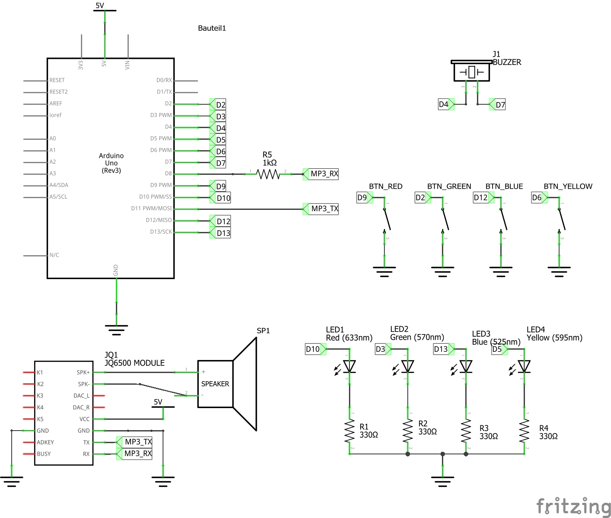
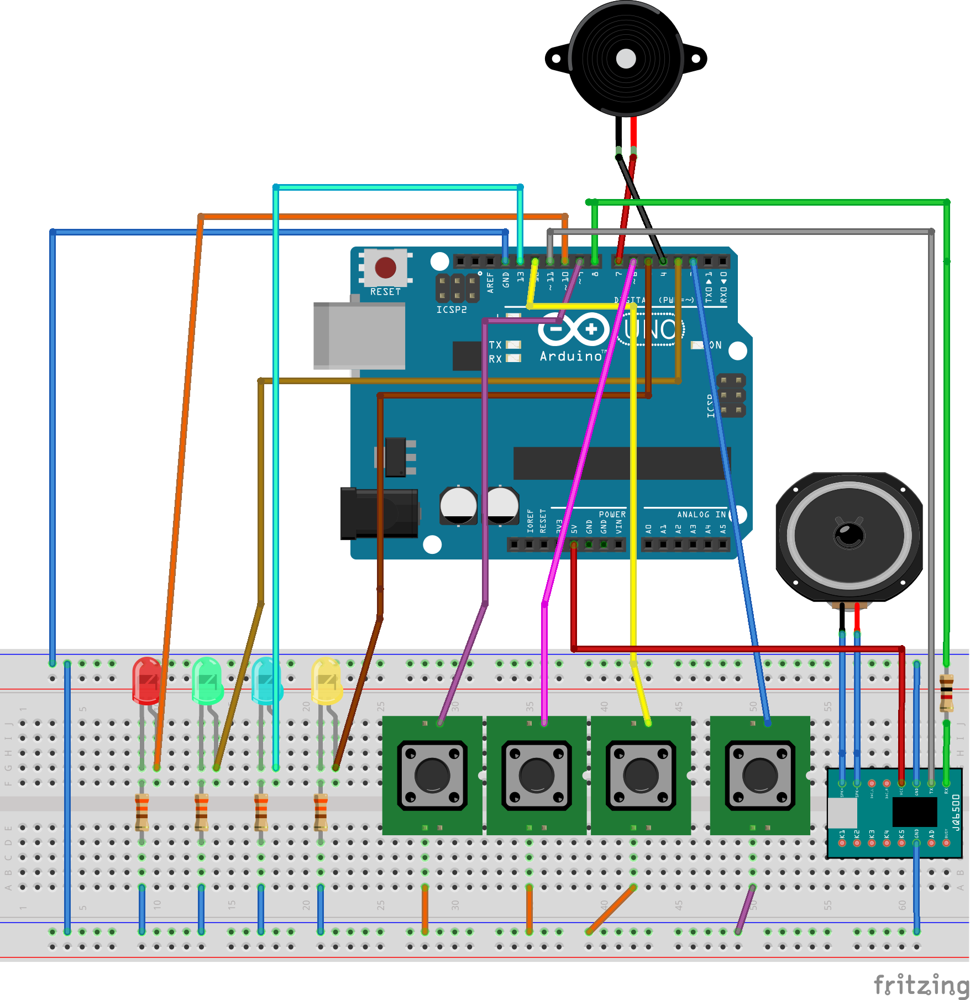

# Simon Says MP3 version

# Important 

* for successful compilation, you must install the JQ6500 library at https://github.com/sleemanj/JQ6500_Serial in your Arduino IDE ([download ZIP](https://github.com/sleemanj/JQ6500_Serial/archive/master.zip) and "Add Library") 

* SoftwareSerial should be pre-installed but can also be found here: https://github.com/PaulStoffregen/SoftwareSerial

* **Resistor R5 (1 kilohm) must be placed in-series with the TX pin of the Arduino Pin (RX pin of the MP3 Module) in order to protect the 3.3V device from the 5V device**

# Wireup

Follow the schematics and diagrams in this repository. There are also PDF versions available.





# Debug 

Connect to the Arduino's serial monitor at 115200 baud. 

The code

```cpp
	Serial.println("Number of files in BUILTIN source: " + String(mp3.countFiles(MP3_SRC_BUILTIN)));
	Serial.println("Number of files in SD source: " + String(mp3.countFiles(MP3_SRC_SDCARD)));
```

should output the number of available songs. If this is all-zero, check your connections (TX,RX) and the power supply of the module